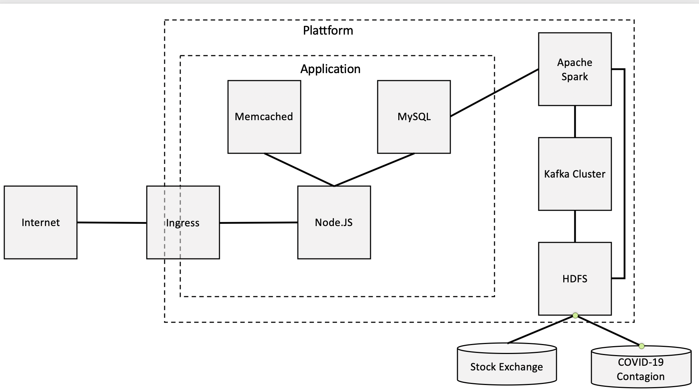

# :fireworks: Big Data Platform :fireworks:

Big Data Platform to run a Corona App via Web. The aim of the project is to provide an correlative illustration between the index "Deutsche Aktien Index" (DAX) and the COVID-19 infections or deaths.

Check "Big Data Architecture" for further information about the functionality and the file Big-Data/LICENCE for lincensification.

## Inhaltsverzeichnis
 1. [Big Data Architecture](#architecture)
 2. [Funktionsweise der Benutzeroberfläche](#oberfläche)
 3. [Screencast der fertigen Anwendung](#screencast)
 4. [Install-Guide](#installation)
 5. [Starting minikube](#minikube)
 6. [Deploy Kafka cluster on K8S](#kafkacluser)
 7. [Deploy HDFS on K8S](#k8s)
 8. [Deploy the database](#deploydb)
 9. [Deploy Spark on K8S](#sparkk8s)
10. [Start User-Interface](#deployinterface)

## :paperclip: Unsere To-Do-Liste (wird später gelöscht)
Unsere to-dos aus dem Pfisterer PDF https://elearning.cas.dhbw.de/pluginfile.php?forcedownload=1&file=%2F%2F69764%2Fblock_quickmail%2Fattachment_log%2F1700%2FAufgabenstellung%20Big%20Data%20Vorlesung%20April%202020.pdf

- [X] Komponente: Data-Lake (HDFS)
- [X] Komponente: Big Data Messaging (Kafka)
- [X] Komponente: Big Data Processing (Apache Spark)
- [X] Komponente: DB Server (mysql)
- [X] Komponente: Load Balancer (Ingress)
- [X] Komponente: Web Server => Fehlerbehebung läuft
- [X] Komponente: Cache Server => Fehlerbehebung läuft
- [X] Daten werden entweder in das System gestreamt oder wiederholt per Batch abgearbeitet
- [X] Das Ergebnis der Berechnungen im Big Data-System werden in der Datenbank gespeichert
- [X] Der Web Server liefert diese Ergebnisse aus
- [X] Lizenz Quellcode (Apache)
- [X] Quellcode der Anwendung, der zum Start und Betrieb der Gesamtanwendung notwendig ist
- [X] Dokumentation der Anwendung
- [X] Screencast => Erstellt FG
- [ ] Dokumentation Architektur
- [ ] Code kommentiert und formatiert und nachvollziehbar
- [X] Grundsätzliche Idee der Anwendung erklären
- [ ] Repo aufräumen
- [ ] Abgabe des Git Repository


## Big Data Architecture :house:<a name="architecture"></a>

### Overview Architektur:
* HDFS speichert Daten zur Börse (Frankfurt Stock Exchange) und Covid-19 (Ansteckungen und Verstorbene pro Tag)
* Die Daten werden durch einen Standalone Python-Import-Pod zyklisch aktualisiert
* Über das Kafka Cluster wird vom Python-Import-Pod eine Benachrichtigung an Apache Spark über neue Daten gesendet
* Apache Spark greift daraufhin auf die Daten im HDFS Cluster zu
* Apache Spark verarbeitet die Daten und sendet diese an den Datenbank-Server
* Der Datenbank-Server speichert die Daten in einer MySQL-DB
* Der Web-Server ruft über eine Schnittstelle zur MySQL-DB die Daten ab
* Das Web-Frontend zeigt dem Nutzer die Daten in einer grafischen Darstellung
* Der Nutzer kann verschieden Parameter ändern, die zu einem entsprechenden Abruf bei der MySQL-DB führt
* Bevor ein Abruf der Daten bei der MySQL-DB erfolgt, wird geprüft, ob das SQL-Statement bereits in Memchached verfügbar ist
* Für weitere Details zu den Komponenten siehe unten



### Python-Import-Pod:
* Importiert stündlich die neuesten Daten aus folgenden Quellen:
  * Frankfurt Stock Exchange: https://www.quandl.com/data/FSE-Frankfurt-Stock-Exchange
  * Infektionsdaten COVID-19: https://opendata.ecdc.europa.eu/covid19/casedistribution/json/
* Daten werden im CSV-Format auf dem HDFS abgelegt
* Nach Import wird über Kafka eine Benachrichtigung an den Spark Driver Pod gesendet. *(Anmerkung: Integration von Apache Hadoop als Kafka Producer zu aufwendig)*
* PyWebHDFS wird zur Interaktion mit dem HDFS verwendet

### Data Lake (HDFS):
* Daten aus Börse (link siehe Python-Import-Pod) und Daten aus Covid (link siehe Python-Import-Pod) werden als CSV gespeichert
* Daten Covid werden alle 1h aktualisiert. *(Anmerkung: Datenquelle aktualisiert sich jedoch nur täglich)*
* Daten Börse werden alle 1h aktualisiert.
* Apache Knox wird zur Interaktion mit HDFS verwendet.

### Big Data Messaging (Kafka Cluster):
* Messaging System zwischen Apache Spark und HDFS
* Kafka Cluster wird über Helm hochgefahren (siehe: https://strimzi.io/charts/index.yaml)
* Kafka Producer: Python-Import-Pod
* Kafka Consumer: Spark-Driver-Pod
* Topic: spark_notification
* Replikation: 1 *(Anmerkung: Es werden grds. 3 bis 5 broker in einem Kafka Cluster für eine hohe Verfügbarkeit und einen schnellen Durchlauf empfohlen)*
* Mögliche Erweiterung: Web Servcer Producer Nutzungsdaten sendet Nutzungsdaten der Weboberfläche an Data Lake Consumer.

### Big Data&Science Processing (Apache Spark):
* Dient dem Data Processing der Daten aus HDFS
* Besteht aus zwei Komponenten:
 1. Spark-Controller: Läuft dauerhaft im K8S. Startet und überwacht die Ausführung der Spark-Berechnungen.
 2. Spark-Driver: Liest die Importierten Daten aus HDFS und führt Rechenoperationen aus. Speichert Ergebnisdaten in HDFS.
 
#### Spark-Controller
- Pod der als Deamon ausgeführt wird
- Ist Kafka-Konsument. Reagiert auf Kafka Notification und überwacht Spark-Driver ausführung.
- Startet Spark-Driver Ausführung im 'Cluster-Mode'. YML-Datei für Spark-Driver ist auf HDFS gespeichert. (Realisiert mithilfe von Custom-Resource-Definiton)
- Wartet bis Spark-Driver Status "Completed" hat.
- Löscht Spark-Driver aus K8S
- Liest Ergebnisse der Spark-Drivers aus HDFS und export diese in die MYSQL-Database.

#### Spark-Driver
- Wird von Spark-Controller gestartet.
- Führt programmierte Rechenoperationen auf Eingabedaten aus. (Driver-Logik ist in Python-Datei auf HDFS definiert)
- Startet N-Executor Pods die das Ergebnis berechnen. (Anzahl Executor Pods ist in YML-Datei auf HDFS definiert)
  * Unnötige Daten werden aussortiert
  * Aktienkurse werden zu DAX aufsummiert
  * Absolute und relative Veränderungen zwischen den Tagen werden kalkuliert
- Überwacht Executor Pods.
- Sammelt das Ergebnis und schreibt es in das HDFS.

### Datenbank (MySQL-Datenbank): 
* Rationale Datenbank speichert von Apache Kafka aufbereitete Daten.
* Das Datenbankschema besteht aus den Tabellen "infects" und "dax".
  * Die Tabelle "infects" enthält die Spalten: 
  'date' (date), 'cases' (integer), 'deaths' (integer), 'country' (varchar), 'continent' (varchar), 'cases_prev' (integer), 'dead_prev' (integer), 'cases_rel_diff' (decimal), 'deaths_rel_diff' (decimal). 
Die Primärschlüssel sind 'date' und 'country'.
  * Die Tabelle "dax" enthält die Spalten: 
  'date' (date), 'open' (decimal), 'close' (decimal), 'diff' (decimal).
Der Primärschlüssel ist 'date'.

### Web Server (Node.js):
* Zeigt Grafik zu den Daten Covid und Börse an (X-Achse Zeit und Y-Achse Ansteckungen / Kurs)
* Nutzer können Parameter einstellen, die zu einer SQL-Abfrage bei der MySQL-Datenbank führen
* In Memcached werden die bisherigen SQL-Abfragen gespeichert (siehe dazu Memcached)
* Web Server prüft die Verfügbarkeit im Cache bevor er eine SQL-Abfrage bei der MySQL-Dantenbank durchführt (siehe dazu Memcached)

### Cache-Server (Memcached):
* Aus den SQL-Abfragen des Web Servers an den MySQL-Server wird ein Key erstellt und in Memchached abgelegt
* Wenn ein Key nicht vorhanden ist wird die SQL-Abfrage an den MySQL-Server gesendet und in Memcached als Key abgelegt
* In Memcached wird neben dem Key das jeweilige Ergebnis der Abfrage gespeichert
* In Memcached werden Daten maximal X Minuten gespeichert

### Load Balancer (Ingress):
* Ingress => ML ergänzt

## Funktionsweise der Benutzeroberfläche <a name="oberfläche"></a>
Die Benutzeroberfläche entspricht dem Endpunkt der Architektur, über welchen der Enduser in der Regel Daten der Anwendung abfragt. Hierzu kann nach dem Start der unterschiedlichen Architekturkomponenten (min. nach dem Start des Webservers (webapp.js)) die Adresse localhost:8080 über einen beliebigen Internetbrowser aufgerufen werden.

### Anwendungslogik der Oberfläche 
Die Anwendungslogik validiert und Verarbeitet die jeweiligen Nutzeranfragen und aktualisert die auf der Oberfläche angezeigten Grafen. Bei den Parametern der Nutzeranfrage werden folgende unterschieden:

#### Auswahl eines Datumbereichs
Es muss in jedem Fall ein Datumsbereich ausgwählt werden. Je nach größe des Bereichs wird der Graf auf Monate, Kalenderwochen oder Tage skaliert.
* Monate: Datumsrange größer 4 Monate
* Wochen: Datumsrange zwischen 4 Wochen und 4 Monaten
* Tage: Datumsrange kleiner 28 Tage (4 Wochen) 

#### Auswahl der Betrachtungsländer 
Unter Verwendung einer Checkbox-Liste können die Länder ausgewählt werden, deren Coronadaten für den Vergleich herangezogen werden sollen. Das Land "Deutschland" ist standardmäßig ausgewählt

#### Relative Veränderung zum Vortag
Bei den Coronadaten können wahlweise entweder die tatsächliche Tagesveränderung (Neuerkrankungen bzw. Todesfälle) oder die relative Veränderung zum Vortag angezeigt werden.

#### Art der Coronadaten
Bei den Coronadaten können entweder die Neuerkrankungen oder die Todesfälle in Relation zum Aktienkurs angezeigt werden. 

## Screencast der fertigen Anwendung <a name="screencast"></a>
### Screencast Installation
[Screencast Part 1 (Installation)](https://www.youtube.com/watch?v=jReU8k_S5ac "Screencast Part 1 (Installation)")

### Screencast der Oberfläche
[Screencast Part 2 (User Interface)](https://www.youtube.com/watch?v=ZuJHFPglDBE "Screencast Part 2 (User-Interface)")

### Prerequisites 
This Software is required to run the Big-Data Application. (This application is intended to be used on based Ubuntu-OS)
```
minikube
helm
```

# Install-Guide
## Installation Methods <a name="installation"></a>
### Automatic Installation
This is the recommended installation method.
The Base-Directory contains a script to setup the whole environment.
There has to be a empty minikube cluster with Ingress-Addon enabled on your system. [Start Minikube](#minikube)
After minikube has started, execute the installation script
```
sh install_system.sh
```

### Manual installation
Alternatively this system can be installed by executing the necessary commands manually.
The following sections contain the commands that need to be executed to start the components.
The components need to be started in the following order:
1. [Start Minikube](#minikube)
2. [Kafka Cluster] (#kafkacluser)
3. [HDFS] (#k8s)
4. [MYSQLDB and MemcacheD] (#deploydb)
5. [Start Spark] (#sparkk8s)
6. [User-Interface] (#deployinterface)

## Starting minikube <a name="minikube"></a>

Start minikube with driver depending on your OS.
```
#on Win 10
minikube start --driver=hyperv --memory 5120 --cpus 4

#on Mac
minikube start --vm-driver=hyperkit --memory 5120 --cpus 4

#on Ubuntu
minikube start --driver=none
```

Enable Load Balancer (Ingress)
```
minikube addons enable ingress
```

Pointing Docker daemon to minikube registry (Not needed on Ubuntu)
```
#on Win 10
minikube docker-env
minikube -p minikube docker-env | Invoke-Expression

#on Mac
eval $(minikube docker-env)
```

## Deploy Kafka cluster on K8S: <a name="kafkacluser"></a>
### Install Strimzi operator and Cluster Definition
Execute the following commands to install kafka cluster.
Alternatively run 'sh install_kafka.sh' in the ../kafka-config folder to install whole kafka component.
```
#Install strimzi operator via Helm
helm repo add strimzi http://strimzi.io/charts/
helm install kafka-operator strimzi/strimzi-kafka-operator
```
Apply Kafka Cluster Deployment
```
kubectl apply -f kafka-cluster-def.yaml
```

## Deploy HDFS on K8S: <a name="k8s"></a>
### Deploying HDFS 
Execute the following commands to install the apache hadoop distributed filesystem component.
Alternatively run 'sh install_hdfs.sh' in the ../python_hdfs folder to install whole hdfs component.

```
#Add helm stable repo and install chart for stable hadoop cluster
helm repo add stable https://kubernetes-charts.storage.googleapis.com/
# if using helm for the first time run "helm init"
helm install --namespace=default --set hdfs.dataNode.replicas=2 --set yarn.nodeManager.replicas=1 --set hdfs.webhdfs.enabled=true hadoop stable/hadoop

#Adjust user rights on root folder to be able to acces filesystem via WEBHDFS
kubectl exec -ti hadoop-hadoop-yarn-rm-0 -- hdfs dfs -chmod  777 /
```

### Install Apache Knox - REST API and Application Gateway
Install Apachae Knox API and Gateway using helm chart pfisterer/apache-knox-helm
```
helm repo add pfisterer-knox https://pfisterer.github.io/apache-knox-helm/
helm install --set "knox.hadoop.nameNodeUrl=hdfs://hadoop-hadoop-hdfs-nn:9000/" --set "knox.hadoop.resourceManagerUrl=http://hadoop-hadoop-yarn-rm:8088/ws" --set "knox.hadoop.webHdfsUrl=http://hadoop-hadoop-hdfs-nn:50070/webhdfs/" --set "knox.hadoop.hdfsUIUrl=http://hadoop-hadoop-hdfs-nn:50070" --set "knox.hadoop.yarnUIUrl=http://hadoop-hadoop-yarn-ui:8088" --set "knox.servicetype=LoadBalancer" knox pfisterer-knox/apache-knox-helm
```

### Deploy the periodic import pod on K8S:
Create necessary docker image for Data import POD
```
# After running the docker-env command, navigate to the python_hdfs directory (it contains one dockerfile)
# the created image will connect to the knox-apache-knox-helm-svc via DNS Lookup within the K8S cluster
docker build -t python_download .

#Apply the import deployment inside the python_hdfs directory
kubectl apply -f python_import_deployment.yml
```


## Deploy the database <a name="deploydb"></a>
### Create necessary DB-Pod

Build a connection to the "my-database" folder
```
#navigate to the folder my-database
cd my-database
```

Create a POD and deploy it to minikube
```
kubectl apply -f config-app.yml
kubectl apply -f my-mysql-deployment.yml
```
```
#To be sure that the POD is running and to get the POD-name, enter
kubectl get pods -o wide
#You have to choose the POD with the name my-mysql-deployment-xxxxxxxxx-xxxxx (x=numbers/characters)
```

```
#Enter the pod to check if its working
kubectl exec -ti [my-mysql-deployment-xxxxxxxxx-xxxxx] -- mysql -u root --password=mysecretpw
```
### Create necessary Memcached-Pod

Create a POD and deploy it to minikube
```
kubectl apply -f my-memcache-deployment.yml
```
## Deploy Spark on K8S <a name="sparkk8s"></a>
### Spark Operator
Execute the following commands to install pyspark.
Alternatively run 'sh install_pyspark.sh' in the ../pyspark-app folder to install whole pyspark component.
```
#navigate to the folder "pyspark-app"
#Create a namespace with the name ‘spark-operator’
kubectl create namespace spark-operator

#create a service account with the name ‘spark’
kubectl create serviceaccount spark --namespace=default

#create RBAC role for spark serviceaccount
kubectl create clusterrolebinding spark-operator-role --clusterrole=cluster-admin --serviceaccount=default:spark --namespace=default

#add helm repo
helm repo add incubator http://storage.googleapis.com/kubernetes-charts-incubator

#install helm chart incubator spark-operator
helm install spark incubator/sparkoperator --namespace spark-operator --set sparkJobNamespace=default
```

### Spark Controller Pod
This pod automatically reacts to kafka messages and starts a custom spark-drive resource via the Kubernetes API
The result of the calculation is then stored to the Database
```
# Create clusterrolebinding for spark controller pod
kubectl create clusterrolebinding default-edit-role --clusterrole=cluster-admin --serviceaccount=default:default --namespace=default

# Create docker image for driver
docker build -t spark_control .

# run deployment
kubectl apply -f spark_control_deployment.yml
```

## Start User-Interface <a name="deployinterface"></a>

Check if service is running on minikube
```
minikube dashboard
```

Navigate to /app/
```
cd ../app/
```

Build Interface-Dockerfile and run interface-deployment
```
docker build -t interface .
```

Run interface-Deployment
```
kubectl apply -f interface-deployment.yml
```
